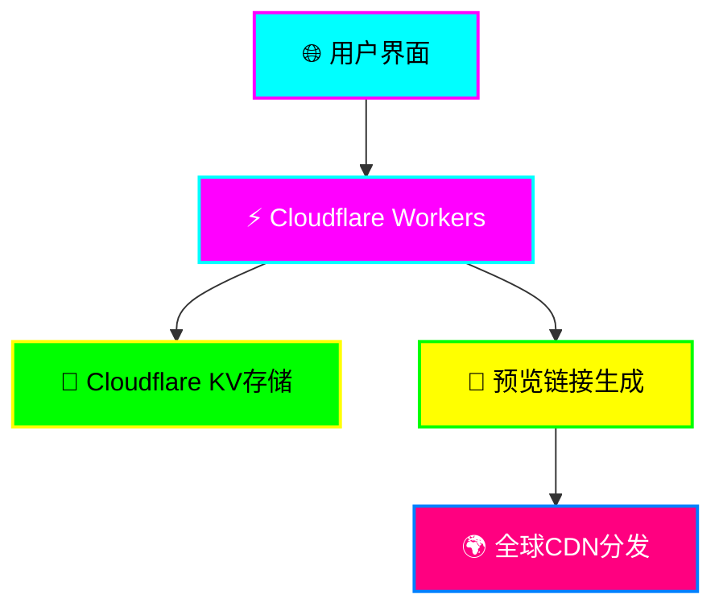

<div align="center">

# ⚡ HTML Showing ⚡
### 🚀 未来科技风在线HTML预览服务 🚀


**🌟 基于Cloudflare Workers的超炫酷在线HTML预览服务 🌟**

*支持文件上传和代码粘贴，一键生成可分享的预览链接*

[🚀 立即体验](https://html.djxs.xyz/) • [📖 使用文档](#-使用指南) • [🛠️ 部署教程](#-快速部署) • [🎨 预览截图](#-界面预览)

---

</div>

## ✨ 核心特性

<table>
<tr>
<td width="50%">

### � **智能上传**
- 📁 拖拽上传HTML文件
- 📝 代码编辑器粘贴
- ⚡ 实时预览生成
- 🎯 多格式支持

</td>
<td width="50%">

### 🚀 **极速体验**
- ⚡ 毫秒级响应
- 🌐 全球CDN加速
- 📱 完美移动适配
- 🔒 安全可靠存储

</td>
</tr>
<tr>
<td width="50%">

### 💎 **科技美学**
- 🌈 霓虹发光效果
- ✨ 动态粒子背景
- 🎨 彩虹渐变按钮
- 💫 流畅动画交互

</td>
<td width="50%">

### 🔗 **便捷分享**
- 🆔 唯一预览链接
- ⏰ 365天长期有效
- 📋 一键复制分享
- 💫 全球访问无阻

</td>
</tr>
</table>

## 🛠️ 技术架构



<div align="center">

### 🎯 **技术栈一览**

| 分类 | 技术 | 描述 |
|------|------|------|
| 🚀 **后端** | Cloudflare Workers | 边缘计算，全球部署 |
| 💾 **存储** | Cloudflare KV | 分布式键值存储 |
| 🎨 **前端** | HTML5/CSS3/JS | 原生技术，极致性能 |
| 🌐 **CDN** | Cloudflare | 全球加速网络 |
| 🔧 **部署** | Wrangler CLI | 一键自动部署 |

</div>

## 🚀 快速部署

<div align="center">

### ⚡ **三步极速部署** ⚡

</div>

<table>
<tr>
<td width="33%">

#### 🔧 **第一步：准备环境**
```bash
# 安装 Wrangler CLI
npm install -g wrangler

# 登录 Cloudflare
wrangler login
```

</td>
<td width="33%">

#### 📦 **第二步：克隆项目**
```bash
# 克隆仓库
git clone https://github.com/xiyewuqiu/HTML-showing.git

# 进入目录
cd html-showing
```

</td>
<td width="33%">

#### 🚀 **第三步：一键部署**
```bash
# 创建 KV 命名空间
wrangler kv:namespace create "HTML_STORAGE"

# 部署到 Cloudflare
wrangler deploy
```

</td>
</tr>
</table>

---

### 🛠️ **详细配置指南**

<details>
<summary>📋 <strong>点击展开详细步骤</strong></summary>

#### 🔑 **前置要求**

- ✅ [Cloudflare账户](https://dash.cloudflare.com/sign-up) (免费)
- ✅ [Node.js](https://nodejs.org/) 环境 (v16+)
- ✅ [Git](https://git-scm.com/) 版本控制

#### 📝 **配置KV命名空间**

1. **创建KV命名空间**
   ```bash
   # 创建生产环境命名空间
   wrangler kv:namespace create "HTML_STORAGE"

   # 创建预览环境命名空间
   wrangler kv:namespace create "HTML_STORAGE" --preview
   ```

2. **更新配置文件**
   ```toml
   # wrangler.toml
   [[kv_namespaces]]
   binding = "HTML_STORAGE"
   id = "your-namespace-id-here"
   preview_id = "your-preview-namespace-id-here"
   ```

#### 🎯 **自定义配置**

```toml
# wrangler.toml - 完整配置示例
name = "html-showing"
main = "src/index.js"
compatibility_date = "2024-01-01"

# 自定义域名 (可选)
routes = [
  { pattern = "preview.yourdomain.com/*", zone_name = "yourdomain.com" }
]

# 环境变量 (可选)
[vars]
ENVIRONMENT = "production"
MAX_FILE_SIZE = "10485760"  # 10MB
```

</details>

---

### 🌟 **部署成功验证**

部署完成后，你将看到类似输出：

```bash
✨ Success! Deployed to https://html-showing.your-subdomain.workers.dev
```

🎉 **恭喜！你的HTML预览服务已经上线！**

## 💫 使用指南

<div align="center">

### 🎯 **四步轻松预览** 🎯

</div>

<table>
<tr>
<td width="25%" align="center">

#### 1️⃣ **访问服务**
🌐 打开部署的URL
⚡ 享受科技感界面

</td>
<td width="25%" align="center">

#### 2️⃣ **上传内容**
📁 拖拽HTML文件
📝 或粘贴代码

</td>
<td width="25%" align="center">

#### 3️⃣ **生成链接**
🚀 点击生成按钮
⚡ 秒速创建预览

</td>
<td width="25%" align="center">

#### 4️⃣ **分享预览**
📋 一键复制链接
🌍 全球访问分享

</td>
</tr>
</table>

---

### 🎨 界面预览

<div align="center">

#### 🌟 **科技炫酷主界面** 🌟

```
┌─────────────────────────────────────────────────────────────┐
│                    ⚡ HTML在线预览 ⚡                        │
│              🚀 上传HTML文件或粘贴代码，生成炫酷预览链接 🚀    │
├─────────────────────────────────────────────────────────────┤
│  ⚡ 文件上传    💻 代码输入                                   │
├─────────────────────────────────────────────────────────────┤
│                                                             │
│                    🔮                                       │
│              选择HTML文件或拖拽到此处                         │
│                                                             │
├─────────────────────────────────────────────────────────────┤
│              🚀 启动预览生成器 🚀                            │
└─────────────────────────────────────────────────────────────┘
```

#### ✨ **特色功能展示** ✨

- 🌈 **霓虹发光效果**: 所有按钮和文字都有炫酷的霓虹发光
- ✨ **动态粒子背景**: 移动的网格线和闪烁粒子效果
- 🎨 **彩虹渐变按钮**: 多彩渐变按钮，悬停时有光波扫描
- � **流畅动画交互**: 每个操作都有精心设计的动画反馈

</div>

---

### 🔧 高级功能

<details>
<summary>🚀 <strong>API接口文档</strong></summary>

#### 📡 **RESTful API**

##### `POST /api/upload`
上传HTML内容并生成预览链接

**请求参数:**
```javascript
// FormData
{
  "html": "<!DOCTYPE html>..."  // HTML内容
}
```

**响应格式:**
```json
{
  "success": true,
  "previewUrl": "https://your-domain.workers.dev/preview/uuid-here",
  "previewId": "uuid-here"
}
```

##### `GET /preview/{id}`
访问HTML预览页面

**参数:**
- `id`: 预览唯一标识符

**响应:** 完整渲染的HTML页面

</details>

<details>
<summary>📁 <strong>项目结构</strong></summary>

```
html-showing/
├── 📄 src/
│   └── 🚀 index.js          # 核心Worker逻辑 (1300+ 行)
│       ├── 🌐 HTTP路由处理
│       ├── 🎨 科技风CSS样式
│       ├── ⚡ 动态JavaScript
│       └── � 工具函数
├── ⚙️ wrangler.toml         # Cloudflare配置
├── 📦 package.json          # 项目依赖
└── 📖 README.md            # 项目文档
```

**核心文件说明:**
- `src/index.js`: 包含完整的前后端逻辑
- `wrangler.toml`: Cloudflare Workers部署配置
- `package.json`: 项目元数据和依赖管理

</details>

---

## � 安全与隐私

<div align="center">

### 🛡️ **企业级安全保障** 🛡️

</div>

<table>
<tr>
<td width="50%">

#### 🔐 **数据安全**
- 🆔 UUID随机链接生成
- 🔒 Cloudflare企业级加密
- ⏰ 自动过期清理机制
- 🚫 无用户数据收集

</td>
<td width="50%">

#### 🌐 **网络安全**
- 🛡️ DDoS攻击防护
- 🔥 WAF防火墙保护
- 📡 HTTPS强制加密
- 🌍 全球边缘节点

</td>
</tr>
</table>

**🔒 隐私承诺:**
- ✅ 不记录用户IP地址
- ✅ 不存储个人信息
- ✅ 预览链接365天后自动销毁
- ✅ 符合GDPR隐私法规

---

## 🤝 贡献指南

<div align="center">

### 💖 **欢迎加入我们的开源社区！** 💖

</div>

#### 🚀 **如何贡献**

1. **🍴 Fork 项目**
   ```bash
   # Fork 到你的 GitHub 账户
   # 然后克隆到本地
   git clone https://github.com/xiyewuqiu/HTML-showing.git
   ```

2. **🌿 创建分支**
   ```bash
   # 创建功能分支
   git checkout -b feature/amazing-feature

   # 或修复分支
   git checkout -b fix/bug-fix
   ```

3. **💻 开发代码**
   ```bash
   # 本地开发测试
   wrangler dev

   # 提交更改
   git commit -m "✨ Add amazing feature"
   ```

4. **📤 提交PR**
   ```bash
   # 推送到你的仓库
   git push origin feature/amazing-feature

   # 然后在GitHub创建Pull Request
   ```

#### 🎯 **贡献类型**

- 🐛 **Bug修复**: 发现并修复问题
- ✨ **新功能**: 添加有用的新特性
- 📚 **文档**: 改进文档和示例
- 🎨 **UI/UX**: 优化界面和用户体验
- ⚡ **性能**: 提升性能和优化代码
- 🧪 **测试**: 添加测试用例

#### � **代码规范**

- 使用有意义的提交信息
- 遵循现有的代码风格
- 添加必要的注释
- 确保代码通过测试

---

## 📊 项目统计

<div align="center">


</div>

---

## 📄 许可证

<div align="center">

### � **MIT License** 📜

**本项目采用MIT许可证，完全开源免费！**

```
MIT License

Copyright (c) 2024 HTML Showing

Permission is hereby granted, free of charge, to any person obtaining a copy
of this software and associated documentation files (the "Software"), to deal
in the Software without restriction, including without limitation the rights
to use, copy, modify, merge, publish, distribute, sublicense, and/or sell
copies of the Software, and to permit persons to whom the Software is
furnished to do so, subject to the following conditions:

The above copyright notice and this permission notice shall be included in all
copies or substantial portions of the Software.
```

[📖 查看完整许可证](LICENSE)

</div>

---

## 💖 致谢

<div align="center">

### 🌟 **特别感谢** 🌟

</div>

<table>
<tr>
<td width="33%" align="center">

#### ☁️ **Cloudflare**
提供强大的Workers平台
和全球CDN服务

</td>
<td width="33%" align="center">

#### 🌐 **开源社区**
感谢所有贡献者
和使用者的支持

</td>
<td width="33%" align="center">

#### 💡 **创意灵感**
来自对美好网络体验
的不懈追求

</td>
</tr>
</table>

---

<div align="center">

### 🚀 **立即开始你的HTML预览之旅！** 🚀

[⭐ 给个Star](https://github.com/xiyewuqiu/HTML-showing.git) • [🍴 Fork项目](https://github.com/xiyewuqiu/HTML-showing/fork) • [🐛 报告问题](https://github.com/xiyewuqiu/HTML-showing/issues) • [💡 功能建议](https://github.com/xiyewuqiu/HTML-showing/discussions)

**如果这个项目对你有帮助，请给个⭐Star支持一下！**

---


</div>
